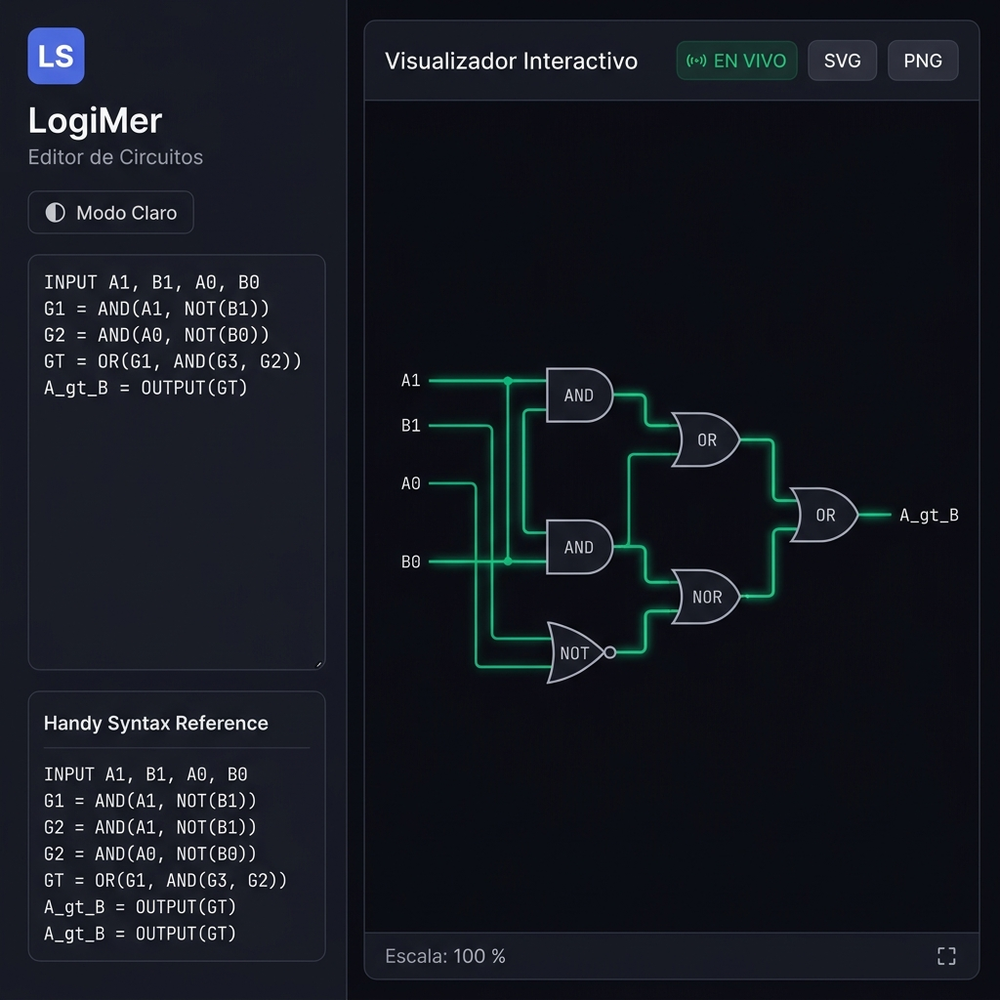
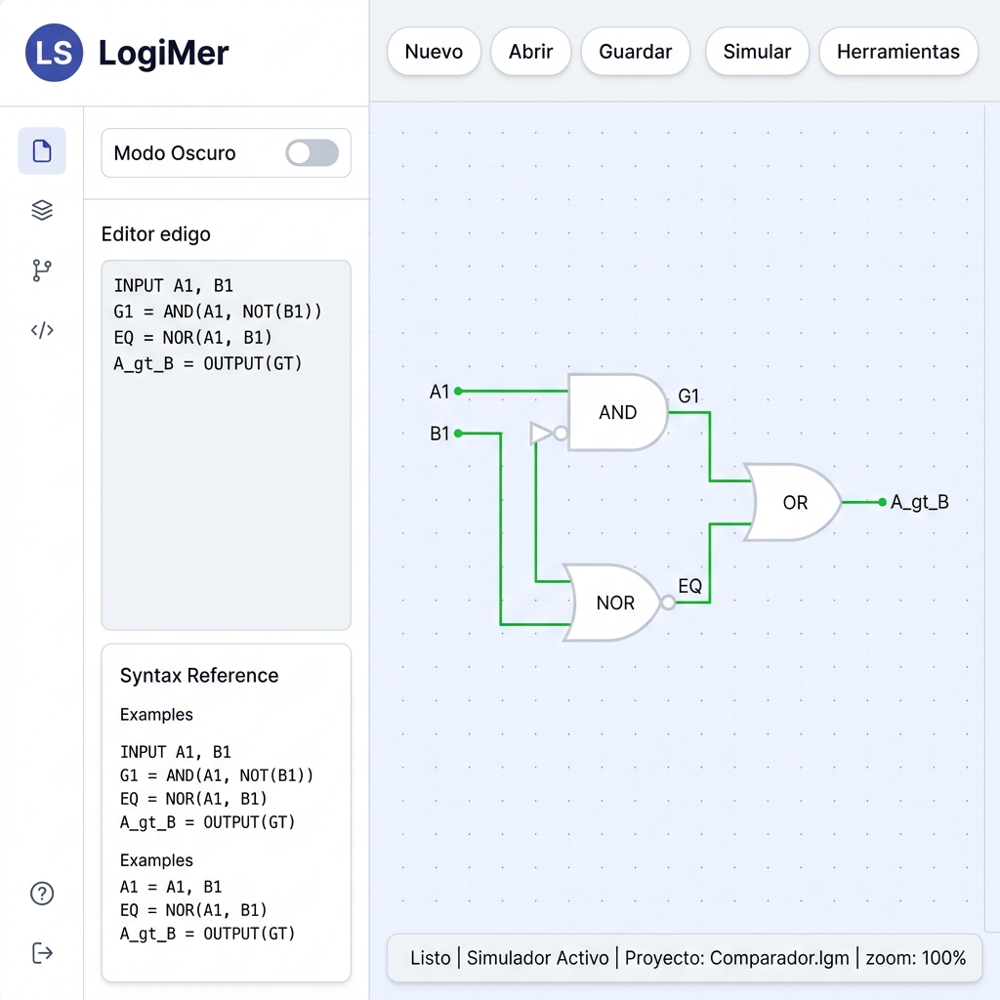
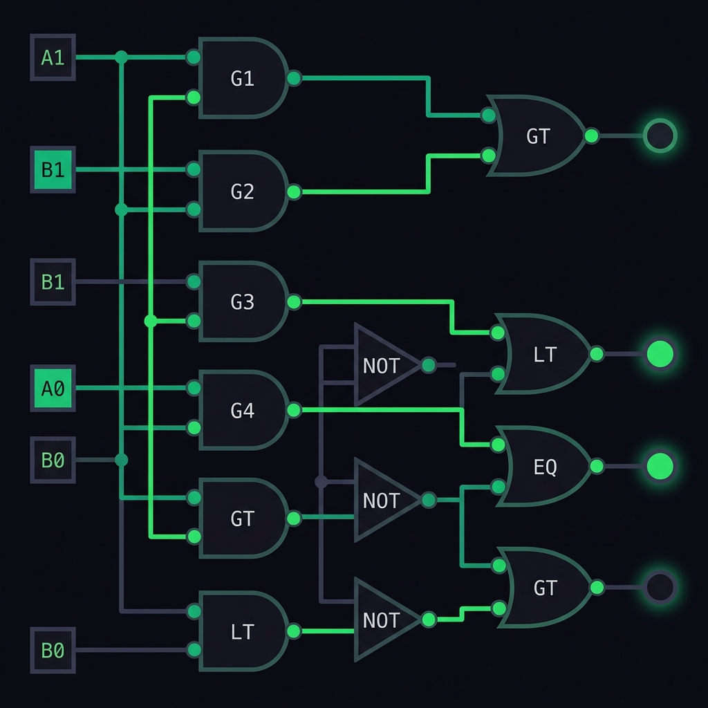

<div align="center">


# LogiMer · Editor de Circuitos Lógicos

**Simulador web interactivo de circuitos lógicos digitales con DSL propio, visualización SVG en tiempo real y exportación de diagramas.**

[](https://react.dev/)
[](https://www.typescriptlang.org/)
[](https://vitejs.dev/)
[](https://tailwindcss.com/)
[](https://github.com/dagrejs/dagre)

</div>

---

## ✨ Vista Previa

### Modo Oscuro


### Modo Claro


### Canvas del Circuito


---

## 🎯 ¿Qué es LogiMer?

**LogiMer** es una aplicación web que convierte descripciones de circuitos lógicos escritas en un lenguaje DSL simple en diagramas SVG interactivos. Escribe las conexiones entre compuertas en el editor de texto y el circuito se renderiza y simula automáticamente en tiempo real.

Es una herramienta educativa pensada para estudiantes de **Lógica Digital** y **Arquitectura de Computadoras** que quieran visualizar y experimentar con circuitos combinacionales sin necesidad de software especializado.

---

## 🚀 Funcionalidades

| Característica | Descripción |
|---|---|
| 🖊️ **DSL propio** | Lenguaje de descripción de circuitos legible y minimalista |
| ⚡ **Simulación en tiempo real** | El estado lógico se propaga instantáneamente al editar |
| 🖱️ **Interactivo** | Haz click en las entradas para alternar entre `0` y `1` |
| 🗺️ **Layout automático** | Dagre organiza los nodos con enrutamiento ortogonal |
| 🔍 **Cámara navegable** | Zoom y paneo con el ratón sobre el canvas |
| 🌙 **Tema dual** | Modo oscuro/claro con transición instantánea |
| 📤 **Exportación** | Descarga el diagrama como **SVG** o **PNG** |
| 📋 **Copiar al portapapeles** | Copia el SVG generado directamente |
| 🖥️ **Pantalla completa** | Canvas expandido para una mejor visualización |

---

## 🧩 Compuertas Soportadas

| Compuerta | Sintaxis | Entradas | Descripción |
|---|---|---|---|
| `AND` | `dest = AND(a, b)` | ≥ 2 | Conjunción lógica |
| `OR` | `dest = OR(a, b)` | ≥ 2 | Disyunción lógica |
| `NOT` | `dest = NOT(a)` | 1 | Negación |
| `NAND` | `dest = NAND(a, b)` | ≥ 2 | NOT-AND |
| `NOR` | `dest = NOR(a, b)` | ≥ 2 | NOT-OR |
| `INPUT` | `INPUT var1, var2` | — | Declara entradas |
| `OUTPUT` | `lbl = OUTPUT(var)` | 1 | Declara salida |

### Anidación de expresiones
Las expresiones se pueden anidar directamente sin necesidad de variables intermedias:

```text
GT = OR(AND(A1, NOT(B1)), AND(NOR(A1, B1), AND(A0, NOT(B0))))
```

---

## 📝 Sintaxis del Lenguaje DSL

```text
# 1. Declarar entradas
INPUT A1, B1, A0, B0

# 2. Definir compuertas (con o sin variables intermedias)
G1 = AND(A1, NOT(B1))
G2 = AND(A0, NOT(B0))
G3 = NOR(A1, B1)

# 3. Compuertas de mayor nivel
GT = OR(G1, AND(G3, G2))

# 4. Declarar salidas
A_gt_B = OUTPUT(GT)
```

### Ejemplo completo — Comparador de 2 bits

```text
INPUT A1, B1, A0, B0

G1 = AND(A1, NOT(B1))
G2 = AND(A0, NOT(B0))
G3 = NOR(A1, B1)
GT = OR(G1, AND(G3, G2))

L1 = AND(NOT(A1), B1)
L2 = AND(NOT(A0), B0)
L3 = NOR(A1, B1)
LT = OR(L1, AND(L3, L2))

EQ = AND(NOR(A1, B1), NOR(A0, B0))

A_gt_B = OUTPUT(GT)
A_lt_B = OUTPUT(LT)
Equal  = OUTPUT(EQ)
```

---

## 🏗️ Arquitectura del Proyecto

```
logisim-web/
├── src/
│   ├── core/                    # Motor de simulación
│   │   ├── Parser.ts            # Parser del DSL → grafo de circuito
│   │   ├── Circuit.ts           # Estructura de datos del circuito
│   │   ├── LayoutEngine.ts      # Layout automático con Dagre
│   │   ├── Gate.ts              # Clase base de compuertas
│   │   ├── Pin.ts               # Pines de entrada/salida
│   │   ├── Wire.ts              # Cables entre compuertas
│   │   └── Gates/               # Implementaciones de cada compuerta
│   │       ├── AndGate.ts
│   │       ├── OrGate.ts
│   │       ├── NotGate.ts
│   │       ├── NandGate.ts
│   │       ├── NorGate.ts
│   │       ├── InputGate.ts
│   │       └── OutputGate.ts
│   ├── components/              # Componentes SVG de renderizado
│   │   ├── GateView.tsx         # Renderizador de compuertas (SVG)
│   │   └── WireView.tsx         # Renderizador de cables (SVG)
│   ├── hooks/                   # Lógica reutilizable
│   │   ├── useCircuit.ts        # Parseo y simulación reactiva
│   │   ├── useCamera.ts         # Control de zoom/paneo del canvas
│   │   └── useExport.ts         # Exportación SVG/PNG
│   ├── context/
│   │   └── ThemeContext.tsx     # Contexto de tema claro/oscuro
│   ├── App.tsx                  # Componente raíz y layout principal
│   └── index.css                # Estilos globales y sistema de diseño
├── docs/                        # Imágenes para documentación
├── index.html
├── vite.config.ts
└── package.json
```

---

## ⚙️ Pipeline de Simulación

```
Código DSL (texto)
      │
      ▼
 Parser.ts  ──────────────────────────────────────────────
      │  Lee línea a línea                                 │
      │  Reconoce INPUT / asignaciones / OUTPUT            │
      │  Evalúa expresiones recursivamente                 │
      │  Crea Gate + Wire por cada operación               │
      ▼
 Circuit.ts  (grafo de compuertas y cables)
      │
      ▼
 Simulación  (propagación topológica de señales)
      │  Cada Gate evalúa su función lógica
      │  Propaga el valor a sus pines de salida
      ▼
 LayoutEngine.ts  (Dagre LR)
      │  Asigna coordenadas X,Y a cada nodo
      │  Genera puntos de control para los cables
      ▼
 GateView / WireView  (SVG React)
      │  Renderiza el diagrama en el canvas
      │  Colorea verde (#10b981) las señales activas
      ▼
 Canvas interactivo
```

---

## 🛠️ Instalación y Uso

### Requisitos
- Node.js ≥ 18
- npm ≥ 9

### Pasos

```bash
# 1. Clona el repositorio
git clone https://github.com/<tu-usuario>/logisim-web.git
cd logisim-web

# 2. Instala dependencias
npm install

# 3. Inicia el servidor de desarrollo
npm run dev
```

Abre [http://localhost:5173](http://localhost:5173) en tu navegador.

### Otros comandos

```bash
npm run build    # Genera la build de producción en /dist
npm run preview  # Previsualiza la build de producción
npm run lint     # Ejecuta ESLint
```

---

## 🎨 Sistema de Diseño

LogiMer sigue el sistema **Cohere 2026** con soporte nativo de tema oscuro/claro:

| Token | Oscuro | Claro |
|---|---|---|
| Fondo principal | `#17171c` | `#f1f5ff` |
| Superficie sidebar | `#12121a` | `#ffffff` |
| Canvas | `#0a0a10` | `#f8f9fb` |
| Acento primario | `#4c6ee6` | `#1863dc` |
| Señal activa | `#10b981` | `#059669` |
| Borde | `#2a2a38` | `#e5e7eb` |

- **Tipografía**: Space Grotesk (UI) · JetBrains Mono (código/SVG)
- **Componentes**: Tailwind CSS 4 con variantes `dark:`
- **Animaciones**: Micro-transiciones de 150ms + pulso en señal EN VIVO

---

## 📦 Dependencias Principales

| Paquete | Versión | Uso |
|---|---|---|
| `react` | `^19` | Framework de UI |
| `react-dom` | `^19` | Renderizado DOM |
| `dagre` | `^0.8.5` | Layout automático de grafos |
| `tailwindcss` | `^4` | Sistema de utilidades CSS |
| `vite` | `^8` | Bundler y dev server |
| `typescript` | `~6.0` | Tipado estático |

---

## 📄 Licencia

Este proyecto es de uso **educativo**, desarrollado como trabajo académico para la materia de **Lógica de Programación** — 7mo Semestre, 2026.

---

<div align="center">

**LogiMer** · Hecho con ❤️ por Johan · 2026

</div>
